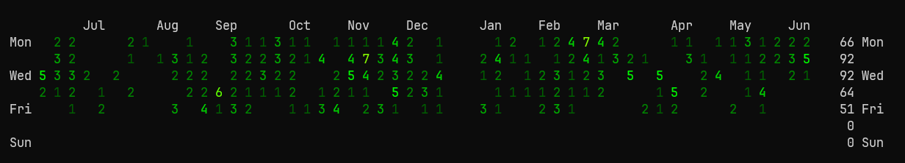

Githeat is a tool for showing a heat map of your git activity.

It was written as a learning exercise in Go, with the intention to end a
discussion at work how frequently we close pull requests and thus release to
production.

### Stuff to improve

- [ ] Refactor into functions for analysis and formatting the output
- [ ] Accept branch name as an argument
- [ ] Filter on tags (for example, to show only releases)
- [ ] Accept multiple repos as arguments, aggregating the counts

### License

Githeat is released under the Apache 2.0 license. See [LICENSE.txt](LICENSE.txt)
for details.
